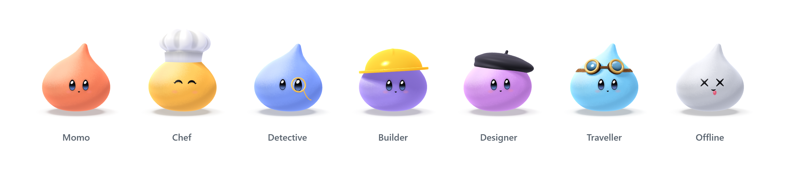

<p align="center">
  <picture>
    <source media="(prefers-color-scheme: dark)" srcset="docs/lineup-dark.png" />
    
  </picture>
</p>

# Momo

A little 3D friend for your AI chats. It dresses for whatever you ask.

Ask for a recipe and Momo puts on a chef's hat. Paste an error and out comes the monocle. Lose the connection and it plays dead until you're back.

- **16 outfits.** Each one has its own prop, colour and face, picked from what you ask.
- **Runs on any device.** Real 3D on a GPU, lighter meshes on software WebGL, and a Canvas 2D renderer when there is no WebGL at all. Momo is never swapped for a still image.
- **Answers come with cards.** A budget split you can drag, a playlist that plays previews, a packing list you tick off, a storyboard, a workout plan and more. The sidebar has an example chat for each one.
- **Works with no keys.** Out of the box it answers from local rules and a set of written replies. Add a free Gemini key for real answers.
- **Plain JavaScript.** No framework, no build step for development.

## Quick start

Needs Node 20 or newer.

```bash
git clone https://github.com/mortspace/momo
cd momo
npm install
npm run dev
```

Open http://127.0.0.1:5281 and say hi.

### Real replies

Get a free key from [Google AI Studio](https://aistudio.google.com/apikey) and start the server with it:

```bash
GEMINI_API_KEY=your-key npm run dev
```

To keep it out of your shell history, save it once in `~/.momo/gemini.env` as `GEMINI_API_KEY=your-key` and run `node server/dev.mjs --gemini-key-file`.

The key stays on the server and never reaches the browser. On Gemini's free tier, Google may use these chats to improve its products.

### Smarter outfits

By default, keyword rules pick the outfit. For better picks, Momo can ask [Jev](https://typesafe.ai) to choose the outfit, mood and reply length. Paste a Jev key into **Playground > Brain**, or save it in `~/.momo/jev.env` as `JEV_AI_API_KEY=your-key` and run with `--use-key-file`. Jev is a paid API, billed per input token.

## Outfits

| Coding                         | Everyday                                |
| ------------------------------ | --------------------------------------- |
| Builder, apps and sites        | Chef, recipes and meals                 |
| Captain, git and releases      | Writer, posts and emails                |
| Tester, runs the tests         | Tutor, explains things                  |
| Guard, asks before risky steps | Planner, plans and bookings             |
| Detective, bugs and errors     | Traveller, trips                        |
| Designer, UI and type          | Music, Coach, Money, Gardener, Director |

You can also make your own bot. Give it a name and a job, and Momo picks the outfit that fits.

## How a reply works

1. Sums, the time, the date and short greetings are answered on the device. No calls.
2. Jev (or the keyword rules) picks the outfit, the mood and how long the reply should be.
3. Gemini 3.5 Flash-Lite writes the reply and streams it in. If Gemini fails, Momo says so in one line and falls back to the written replies.

Each IP gets 12 replies a minute.

## Scripts

| Command          | What it does                                                          |
| ---------------- | --------------------------------------------------------------------- |
| `npm run dev`    | Dev server on port 5281                                               |
| `npm run build`  | Production build into `dist/`                                         |
| `npm start`      | Serves `dist/` on port 5283 and prints a link for your phone          |
| `npm test`       | Shader, outfit switch, brain, writer and build tests                  |
| `npm run bake`   | Rebuilds the meshes in `mesh/` from the shaders (needs `npm run dev`) |
| `npm run format` | Prettier                                                              |

Tests and tools drive a real browser through Playwright. Run `npx playwright install chromium` once before `npm test`.

## Project layout

```
index.html
src/
  app.js          chat, outfits, Playground
  cards.js        answer cards
  cardui.js       card interactions
  artifacts.js    the cards in the example chats
  answers.js      written replies used without a key
  looks.js        outfit names, colours and faces
  icons.js        interface icons
  assets/         card photos and their credits
  engine/
    shaders.js    the character as signed distance fields
    character.js  palettes, outfits and rig
    mesh.js       GPU renderer
    canvas.js     Canvas 2D renderer for devices without WebGL
    raymarch.js   reference renderer
    rig.js        camera, poses and the bendy tip
mesh/             baked meshes, one file per outfit
server/           dev and prod servers, Jev and Gemini calls
tools/            bake, wardrobe renders, parity checks, build
test/
```

## License

[MIT](LICENSE) © mortspace. The meshoptimizer decoder in `src/vendor/` keeps its own MIT licence, and the photos in `src/assets/` keep theirs, listed in [CREDITS.md](src/assets/CREDITS.md).
